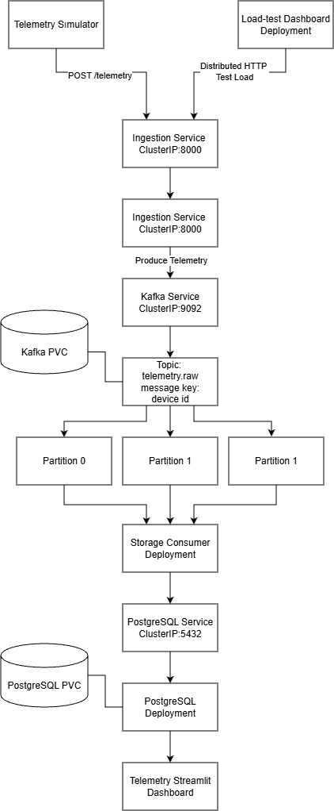
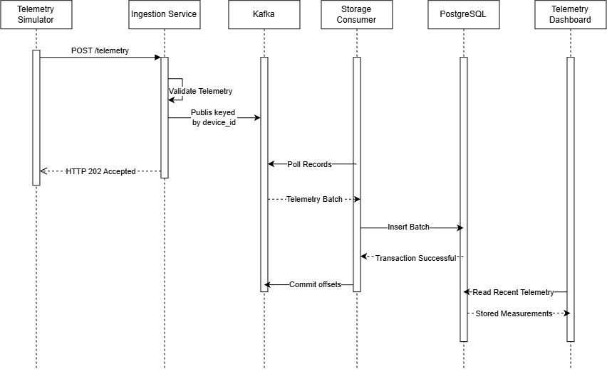

# IoT Monitoring Platform

This project is a small, complete IoT monitoring system. Simulated devices send
temperature and humidity readings to a FastAPI service. The readings travel
through Kafka, are stored in PostgreSQL, and are displayed in Streamlit.

The application is intentionally simple. Its main purpose is to make the
behavior of an event-driven system easy to see, test, scale, and understand.

## What we aim to learn

This project provides a practical environment for learning how:

- a FastAPI service receives and validates telemetry
- a Kafka producer sends keyed messages to a topic
- Kafka partitions and consumer groups support parallel processing
- a consumer batches records and commits offsets safely
- PostgreSQL stores telemetry and behaves under write load
- Docker Compose connects several services on one machine
- Kubernetes runs, observes, and manually scales the same services
- load tests measure throughput, latency, error rate, consumer lag, and CPU use
- measurements can be compared to find system bottlenecks

The performance work follows one simple rule: measure a baseline, increase the
load, observe the system, change one thing, and measure again. This is a
learning project rather than a production-ready IoT platform.

## Main technologies

- Python 3.12
- FastAPI
- Apache Kafka
- PostgreSQL
- Streamlit
- Docker and Docker Compose
- Kubernetes
- Pytest


## Main parts of the project

- **Telemetry simulator:** acts like a group of IoT devices and sends generated
  temperature and humidity readings over HTTP.
- **Telemetry ingestion service:** provides `POST /telemetry`, validates each
  reading, and publishes it to Kafka using `device_id` as the message key.
- **Kafka:** keeps incoming readings in the three-partition `telemetry.raw`
  topic until consumers process them.
- **Storage consumer:** reads Kafka records in batches, inserts them into
  PostgreSQL, and commits the Kafka offsets after a successful database commit.
- **PostgreSQL:** permanently stores the telemetry used by the dashboards.
- **Telemetry dashboard:** shows recent stored readings and current values for
  each device.
- **Load-test dashboard:** starts named load tests, stores separate JSON results,
  compares test runs, and displays HTTP, Kafka, consumer, database, and pod CPU
  measurements.

## Architecture



# Architecture and Data Flow

The platform receives telemetry from simulated IoT devices and processes it through a simple event-driven pipeline.

The **Telemetry Simulator** sends `HTTP POST /telemetry` requests, while the **Load-Test Dashboard** can generate distributed HTTP traffic for performance tests.

The **Kubernetes Ingestion Service** receives these requests and distributes them between the **FastAPI ingestion pods**. Each ingestion pod:

- Validates the telemetry
- Adds ingestion information
- Publishes the message to the Kafka topic `telemetry.raw`

The `device_id` is used as the **Kafka message key**, which ensures that messages from the same device are sent to the same partition and remain ordered.

The topic has **three partitions**, allowing up to three storage-consumer pods to process messages actively in the same consumer group.

Storage consumers:

1. Read messages in batches
2. Insert them into PostgreSQL
3. Commit their Kafka offsets after the database transaction succeeds

**PostgreSQL** stores the telemetry permanently on its persistent volume.

Finally, the **Streamlit dashboard** sends read-only queries through the PostgreSQL Service and displays the stored telemetry.

---

## Telemetry Simulator

Represents the IoT devices.

It generates temperature and humidity readings and sends them to the ingestion API using HTTP.

## Load-Test Dashboard Deployment

Starts controlled load tests against the ingestion API.

It also records:

- HTTP performance
- Kafka lag
- Consumer activity
- PostgreSQL activity
- Pod CPU

Multiple dashboard pods can be used to generate distributed load during tests.

## Ingestion Service — `ClusterIP:8000`

Provides one stable internal address for the ingestion API.

Kubernetes distributes incoming HTTP connections between the available ingestion pods.

## Ingestion Deployment — FastAPI Pods

Validates incoming telemetry, adds the ingestion timestamp, and publishes the message to Kafka.

This Deployment can be manually scaled to:

- 1 pod
- 2 pods
- 4 pods

during experiments.

## Kafka Broker and Service — `ClusterIP:9092`

Provides the internal Kafka address and runs the broker that stores the topic and its partitions.

The project uses **one Kafka broker** because it is a local learning environment.

## Kafka PVC

Stores Kafka data outside the Kafka container.

Topic data remains available if the Kafka pod is restarted or replaced.

## Topic: `telemetry.raw`

Receives telemetry from the ingestion pods.

Messages use `device_id` as their key so that all records from one device go to the same partition.

## Partitions 0, 1, and 2

Divide the Kafka topic so messages can be processed in parallel.

Kafka assigns these partitions dynamically to consumers.

Because there are **three partitions**, no more than **three storage consumers** can actively consume at the same time.

## Storage Consumer Deployment

Reads telemetry from Kafka, groups records into batches, and inserts them into PostgreSQL.

It commits Kafka offsets only after the database transaction succeeds.

It can be scaled during tests, but a **fourth consumer remains idle** while the topic has only three partitions.

## PostgreSQL Service — `ClusterIP:5432`

Provides a stable internal address for services that need to connect to PostgreSQL.

- Storage consumers use it for writes.
- The Streamlit dashboard uses it for read-only queries.

## PostgreSQL Deployment

Runs the PostgreSQL database pod.

It stores:

- The telemetry table
- Database statistics used by the dashboards

## PostgreSQL PVC

Stores the PostgreSQL database files outside the container.

The telemetry remains available after the PostgreSQL pod is restarted or replaced.

## Telemetry Streamlit Dashboard

Reads stored telemetry from PostgreSQL and displays recent device measurements.

It is **read-only** and does not change telemetry records.



# Telemetry Message Sequence

The sequence diagram shows how one telemetry message moves through the system.

The **Telemetry Simulator** sends a reading to the **Ingestion Service** using:

```http
POST /telemetry
```

The Ingestion Service then:

- Validates the reading
- Publishes it to Kafka
- Uses `device_id` as the Kafka message key
- Returns an `HTTP 202 Accepted` response

The **Storage Consumer** polls Kafka for new records, processes them as a batch, and inserts the batch into **PostgreSQL**.

After the database transaction succeeds, the consumer commits the **Kafka offsets** so the records are not processed again during normal operation.

Finally, the **Telemetry Dashboard** reads the latest stored measurements from PostgreSQL and displays them to the user.

## Repository structure

```text
iot_python_project/
|-- dashboard/
|   |-- app.py                 # Telemetry dashboard
|   |-- load_tests.py          # Load-test dashboard
|   `-- pipeline_metrics.py    # Kafka, consumer, PostgreSQL, and CPU metrics
|-- database/
|   `-- init.sql               # Telemetry table and database setup
|-- docs/
|   `-- diagrams/              # Architecture and data-flow diagrams
|   `-- scripts/               # Short explanations for important Python files
|-- kubernetes/                # Kubernetes workloads, services, storage, and config
|-- scripts/
|   |-- simulate_telemetry.py  # Small telemetry generator
|   |-- load_test.py           # Command-line HTTP load generator
|   `-- compare_benchmarks.py  # Compares saved load-test results
|-- services/
|   |-- telemetry_ingestion/
|   |   `-- main.py            # FastAPI ingestion and Kafka producer
|   `-- storage_consumer/
|       `-- main.py            # Kafka consumer and PostgreSQL writer
|-- shared/                    # Shared telemetry model and configuration
|-- tests/                     # Automated unit and service tests
|-- compose.yaml               # Local multi-container environment
|-- Dockerfile                 # Application and test container images
|-- pyproject.toml             # Python dependencies and test configuration
`-- README.md
```

## Dashboards

### Telemetry dashboard

The telemetry dashboard reads from PostgreSQL and shows the newest stored
measurements. It is useful for confirming that the complete data flow is
working. It does not write or change telemetry.

### Load-test dashboard

The load-test dashboard sends controlled HTTP traffic to the ingestion service.
Before a test, you can enter a test name and choose values such as request count,
concurrency, and device count. Each named run is saved separately so different
inputs and scaling configurations can be compared.

The dashboard reports:

- successful requests, errors, and requests per second
- p50, p95, and p99 HTTP latency
- Kafka messages per second, consumer lag, and backlog trend
- storage-consumer processing rate, batch latency, and commit latency
- PostgreSQL inserted rows per second, insert latency, and CPU activity
- Kubernetes CPU usage for each ingestion and storage-consumer pod

Some infrastructure measurements are available only when the dashboard runs in
Kubernetes and the Kubernetes Metrics Server is working.

## Requirements

Choose one of these environments:

- **Docker:** Docker Desktop with Docker Compose
- **Kubernetes:** Docker Desktop with Kubernetes enabled, plus `kubectl`

The commands below use PowerShell and should be run from the repository root.
No local Kafka or PostgreSQL installation is needed.

## Quick start with Docker Compose

### 1. Check and build the containers

```powershell
docker compose config
docker compose build
```

### 2. Start PostgreSQL and Kafka

```powershell
docker compose up -d --wait postgres kafka
```

### 3. Create the Kafka topic

Automatic topic creation is disabled, so create the topic before starting the
storage consumer:

```powershell
docker compose exec kafka /opt/kafka/bin/kafka-topics.sh --bootstrap-server kafka:19092 --create --if-not-exists --topic telemetry.raw --partitions 3 --replication-factor 1
```

### 4. Start the application services

```powershell
docker compose up -d --wait ingestion storage-consumer dashboard load-test-dashboard
docker compose ps
```

All services shown by `docker compose ps` should be running or healthy.

### 5. Send sample telemetry

```powershell
docker compose --profile tools run --rm simulator --devices 3 --count 20 --interval 0.2
```

### 6. Open the application

- Telemetry API health check: `http://localhost:8000/health`
- Telemetry dashboard: `http://localhost:8501`
- Load-test dashboard: `http://localhost:8502`

Refresh the telemetry dashboard after running the simulator. The new readings
should appear after the storage consumer writes them to PostgreSQL.

### Stop the Docker environment

```powershell
docker compose down
```

This stops the containers but keeps the named Docker volumes. Add `-v` only if
you intentionally want to remove the stored Kafka and PostgreSQL data.

## Quick start with Kubernetes

These steps use the local Kubernetes cluster included with Docker Desktop.
Enable Kubernetes in Docker Desktop before continuing.

### 1. Stop the Docker Compose environment

```powershell
docker compose down
```

### 2. Build the local application image

```powershell
docker build --target app -t iot-monitoring-app:local .
```

Docker Desktop Kubernetes can use this local image directly.

### 3. Select and check the cluster

```powershell
kubectl config use-context docker-desktop
kubectl cluster-info
```

If `kubectl cluster-info` fails, wait for Kubernetes to finish starting in
Docker Desktop.

### 4. Create the Kubernetes resources

```powershell
kubectl apply -k kubernetes
kubectl rollout status deployment/postgres -n iot-monitoring --timeout=180s
kubectl rollout status deployment/kafka -n iot-monitoring --timeout=180s
```

### 5. Create the Kafka topic

```powershell
kubectl exec -n iot-monitoring deployment/kafka -- /opt/kafka/bin/kafka-topics.sh --bootstrap-server kafka:9092 --create --if-not-exists --topic telemetry.raw --partitions 3 --replication-factor 1
```

### 6. Wait for the application

```powershell
kubectl rollout status deployment/ingestion -n iot-monitoring --timeout=180s
kubectl rollout status deployment/storage-consumer -n iot-monitoring --timeout=180s
kubectl rollout status deployment/dashboard -n iot-monitoring --timeout=180s
kubectl rollout status deployment/load-test-dashboard -n iot-monitoring --timeout=180s
kubectl get pods,services,pvc -n iot-monitoring
```

Every application pod should show `Running` before sending data.

### 7. Send sample telemetry inside Kubernetes

```powershell
kubectl run telemetry-simulator -n iot-monitoring --rm -i --restart=Never --image=iot-monitoring-app:local --image-pull-policy=IfNotPresent --env=INGESTION_URL=http://ingestion:8000 --command -- python scripts/simulate_telemetry.py --devices 3 --interval 0.2 --count 20
```

### 8. Open the dashboards

Run each command in a separate PowerShell window and leave it running:

```powershell
kubectl port-forward -n iot-monitoring service/dashboard 8501:8501
```

```powershell
kubectl port-forward -n iot-monitoring service/load-test-dashboard 8502:8502
```

Then open:

- Telemetry dashboard: `http://localhost:8501`
- Load-test dashboard: `http://localhost:8502`

Press `Ctrl+C` in each PowerShell window to stop its port forwarding.

### Enable pod CPU measurements

First check whether Metrics Server is already available:

```powershell
kubectl top nodes
```

If the command reports that the Metrics API is unavailable, install Metrics
Server and wait for it:

```powershell
kubectl apply -f https://github.com/kubernetes-sigs/metrics-server/releases/download/v0.9.0/components.yaml
kubectl rollout status deployment/metrics-server -n kube-system --timeout=180s
kubectl top nodes
```

If Docker Desktop reports an `x509` certificate error, apply the included local
development patch:

```powershell
kubectl patch deployment metrics-server -n kube-system --type=json --patch-file kubernetes/metrics-server-docker-desktop-patch.json
kubectl rollout status deployment/metrics-server -n kube-system --timeout=180s
kubectl top pods -n iot-monitoring
```

The certificate patch is only for a local Docker Desktop cluster. Do not use it
for a shared or production cluster.

### Stop and restart the Kubernetes application

To stop the application while keeping the namespace and persistent data:

```powershell
kubectl scale deployment --all --replicas=0 -n iot-monitoring
```

To start it again with the configured replica counts:

```powershell
kubectl apply -k kubernetes
kubectl get pods -n iot-monitoring --watch
```

Press `Ctrl+C` after the pods are running. Avoid deleting the persistent volume
claims unless you intentionally want to remove stored Kafka and PostgreSQL data.

## Run the automated tests

The test image installs the development dependencies and runs the test suite in
an isolated container:

```powershell
docker build --target test -t iot-monitoring-test:local .
docker run --rm iot-monitoring-test:local
```

The tests cover telemetry validation, Kafka publishing behavior, storage
consumer batching and commits, dashboard calculations, and load-test helpers.

## How to run a useful scaling experiment

Use the load-test dashboard and change only one setting between runs:

1. Start with one ingestion pod and one storage-consumer pod.
2. Run a named test and save its measurements.
3. Increase the load until lag or latency begins to grow.
4. Scale either ingestion or storage-consumer pods, but not both at once.
5. Run the same test again and compare the saved results.

Remember that the Kafka topic has three partitions. Up to three storage
consumers can actively process records in the same group; an additional consumer
will normally remain idle. A higher replica count is useful only when the
measurements show that the scaled component is the bottleneck.
